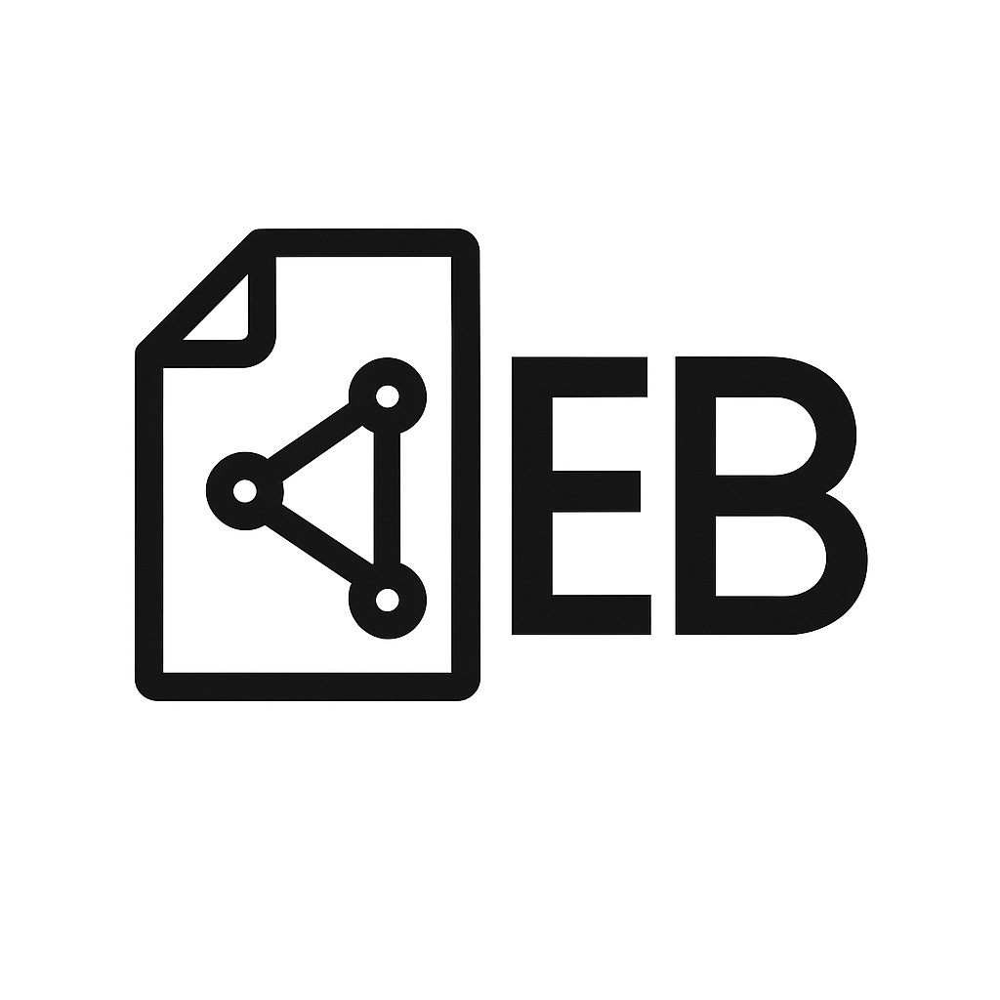
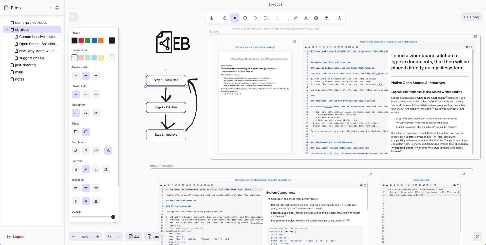

# EB File Board

> A single-user visual workspace where ideas meet files

[](LICENSE)
[](https://nodejs.org/)
[](https://reactjs.org/)
[](https://www.typescriptlang.org/)
[](#)

<div align="center">
  
</div>

## What is EB File Board?
<div align="center">
  
  <p><em>Visual workspace with embedded files, drawing tools, and file management</em></p>
</div>


EB File Board is a browser-based **single-user visual workspace** built on top of [Excalidraw](https://github.com/excalidraw/excalidraw) that combines infinite canvas drawing with file viewing and editing features. Think of it as a personal digital whiteboard where you can sketch ideas, embed documents, and organize your project files - all in one intuitive browser interface.

**⚠️ EXPERIMENTAL**: This software is currently in experimental stage. Features may change and data loss is possible.

**⚠️ Security Notice**: Traffic is unencrypted over the network. Files are stored "as is" too. Best suited for localhost use — LAN usage is at your discretion based on your network trust level. Do not expose it to the Internet.

### Perfect for:
- **Personal brainstorming** with embedded research documents
- **Project planning** with files and visual diagrams
- **Creative workflows** combining sketches with reference materials
- **Local documentation** with visual organization
- **Note-taking** with embedded files and drawings

## Key Features

### **Infinite Visual Canvas**
- Built on [Excalidraw](https://excalidraw.com/) - smooth, responsive drawing experience
- Unlimited canvas space for your ideas
- Professional drawing tools and shapes
- **Light/dark theme support**
- **Image support** - drag and drop images directly onto the canvas

### **Smart File Management**
- Drag-and-drop file uploads
- Hierarchical file tree preview
- Support for **PDFs**, **Markdown**, **text files**, and **images**
- Create new files directly from the interface

### **Embedded File Viewing**
- View PDFs and edit Markdown files **directly on the canvas**
- No need to switch between applications
- Files remain part of your visual workspace

### **Multi-Board Organization**
- Create separate boards for different projects
- Switch between workspaces instantly
- Isolated file management per board

### **Single-User Focus**
- Simple authentication system
- No user management complexity
- Designed for personal productivity

## Quick Start

### Prerequisites
- Node.js 18+ 
- npm or yarn
- Optional: Docker for containerized deployment

### 1. Clone the Repository
```bash
git clone https://github.com/shkonmrdd/eb-file-board.git
cd eb-file-board
```

### 2. Backend Setup
```bash
cd backend
npm install

# Set environment variables (optional)
export JWT_SECRET="your-secret-key-min-32-chars"
export PORT=3001

# Start the backend
npm run dev
```

### 3. Frontend Setup
```bash
cd frontend
npm install

# Start the frontend
npm run dev
```

### 4. First Login
1. Check the backend console for the **BOOTSTRAP TOKEN**
2. Use this token to log in from your browser
3. Save this token - you'll need it for future logins

### Docker Setup (Alternative)
```bash
# Build and run with Docker
docker build -t eb-file-board .

# Run with file persistence (./files = current directory's files folder)
docker run -p 3001:3001 -v ./files:/data/files eb-file-board

# Or with absolute path
docker run -p 3001:3001 -v /path/to/your/files:/data/files eb-file-board
```

## How to Use

### Creating Your First Board
1. **Log in** with the bootstrap token
2. **Create files** using the file creation buttons
3. **Drag files** onto the canvas to embed them
4. **Draw and annotate** around your embedded files
5. **Switch boards** using the board selector

### File Management
- **Upload files**: Drag files from your computer onto the canvas
- **Create new files**: Use the `.txt` and `.md` buttons in the footer
- **Navigate files**: Use the file tree in the sidebar
- **Edit files**: Click on embedded files to edit them inline

### Personal Workflow
- **Localhost or trusted LAN** access
- **Single login token** for simplicity
- **Auto-save** - your work is continuously saved

## Configuration

### Environment Variables

#### Backend
```bash
# Required for production
JWT_SECRET=your-super-secret-minimum-32-characters

# Optional
PORT=3001                          # Server port (default: 3001)
HOST=127.0.0.1                     # Server bind address (default: 127.0.0.1)
BROWSER_TOKEN_EXPIRES_IN=365d      # JWT lifetime (default: 365d)
CORS_ORIGINS=http://localhost:3001 # Comma-separated CORS origins
NODE_ENV=production                # Node.js environment (development/production)
```

#### Frontend
The frontend automatically connects to the backend. For custom configurations, modify `src/constants/config.ts`.

## Project Structure

```
eb-file-board/
├── backend/              # Node.js Express API
│   ├── src/
│   │   ├── controllers/  # Authentication logic
│   │   ├── middleware/   # JWT middleware
│   │   ├── routes/       # API routes
│   │   ├── services/     # Business logic
│   │   └── socket/       # Real-time functionality
│   └── files/            # File storage
├── frontend/             # React TypeScript app
│   ├── src/
│   │   ├── components/   # React components
│   │   ├── pages/        # Pages
│   │   ├── store/        # Zustand state management
│   │   └── services/     # API services
└── docs/                 # Documentation and assets
```


## What EB File Board Can Do

✅ **Single-user visual workspace**  
✅ **Real-time drawing and editing**  
✅ **PDF viewing and embedding**  
✅ **Markdown editing with live preview**  
✅ **Images support: paste them on the board**  
✅ **File tree preview**  
✅ **Multi-board support**  
✅ **Drag-and-drop file uploads**  
✅ **Simple JWT authentication**  
✅ **Light/dark theme support**    

## Current Limitations

**Network**: HTTP only (TLS would require complex certificate management for LAN deployment)  
**File Types**: Limited to PDFs, Markdown, text files, and images  
**User Management**: Single-user system (no multi-user support planned for now)  
**Deployment**: Designed for personal/localhost use  
**Version History**: No file version tracking (planned feature)  
**Mobile**: Optimized for desktop use  
**File Sync**: One-way sync (board changes don't reflect to filesystem - planned improvement)  

## Future Roadmap

### Next Steps
- [x] **Board deletion functionality** - delete boards you no longer need
- [ ] **File deletion functionality** - allow deleting files from the filesystem (currently only removes them from the board)
- [ ] **Bi-directional file sync** - board changes reflect to filesystem and vice versa via WebSocket
- [ ] **Enhanced file support** - more file types beyond current set
- [ ] **Export functionality** - save boards as images/PDFs with baked in file previews; currently it only exports the board's data without the document contents.
- [ ] **Mobile** improvements
- [ ] **File search and filtering**

### Possible future features
- [ ] **Version control for documents** - track changes to your files
- [ ] **MCP server integration** - access and edit docs through Model Context Protocol
- [ ] **Better file organization** - improved folder structures

**Note**: This project will remain single-user focused for now. Multi-user collaboration is not planned.

## License

This project is licensed under the MIT License - see the [LICENSE](LICENSE) file for details.

## Acknowledgments

- [Excalidraw](https://excalidraw.com/) for the amazing drawing engine and the board
- [PDF.js](https://mozilla.github.io/pdf.js/) for PDF rendering
- [React Markdown Editor](https://github.com/uiwjs/react-markdown-editor) for markdown editing
- All other open source libraries listed in the frontend [package.json](frontend/package.json) and backend [package.json](backend/package.json) files

---

<div align="center">
  <p>
    <a href="#what-is-eb-file-board">Features</a> •
    <a href="#quick-start">Quick Start</a> •
    <a href="#how-to-use">Usage</a> •
    <a href="#future-roadmap">Roadmap</a>
  </p>
</div> 